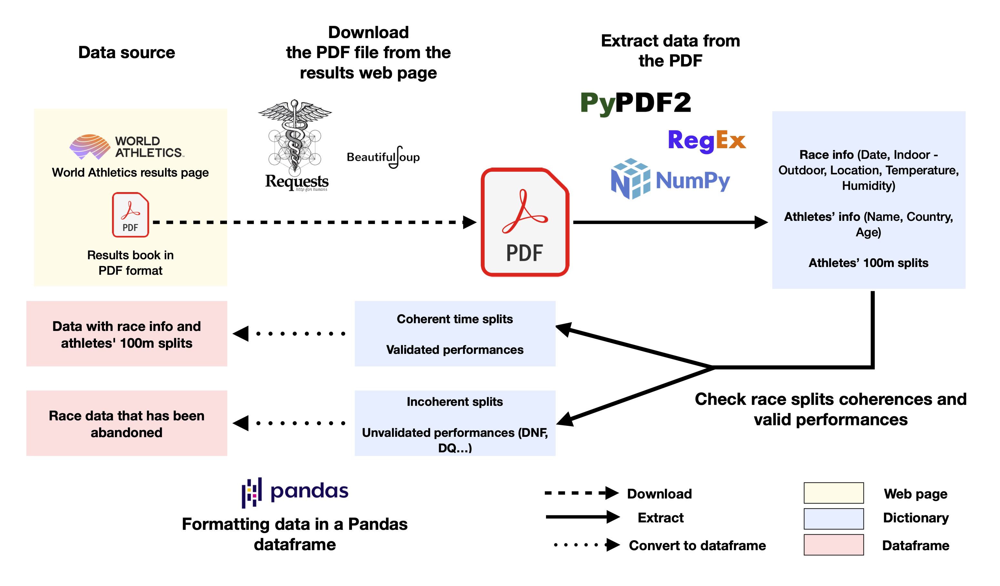
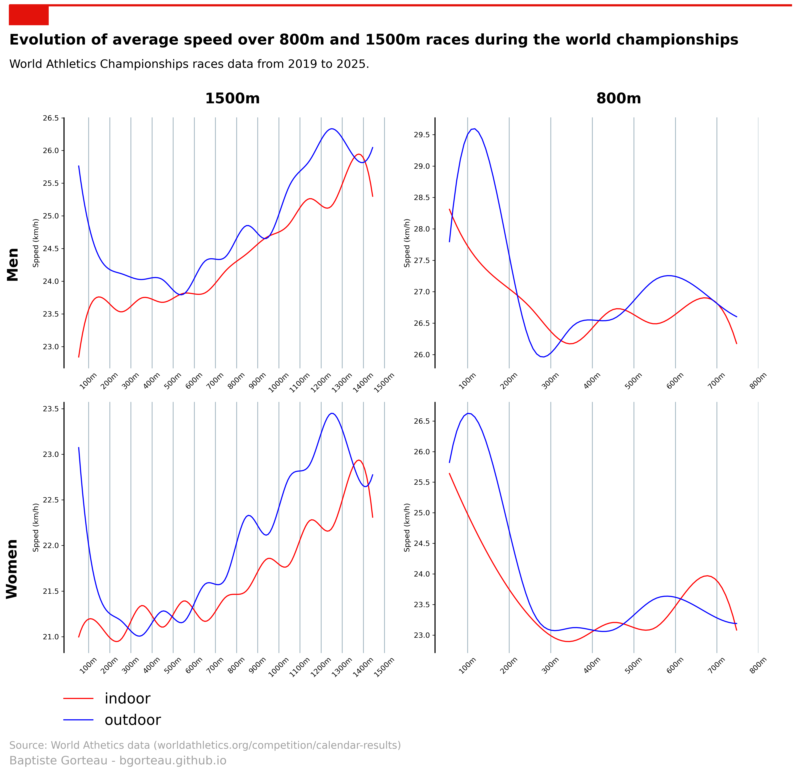

# Scraping of World Athletics championships middle distance and distance data

This project aims to scrape middle distance and distance running data from World Athletics championship competitions. The competitions data are available at these two links ([indoor](https://worldathletics.org/results/world-athletics-indoor-championships) and [outdoor](https://worldathletics.org/results/world-athletics-championships)). The detailed competitions data are then available in result books in PDF format for each race.

For more information about the detailed process, please see the notebook (`notebooks/Scrap_WA_data.ipynb`).

# Technical information

To make the database creation process work, here are the steps you need to follow.

- Set into the right directory:
  `cd /your_path/WA_MD_scrapping`
- Import all the necessary packages:
  `pip install -r requirements.txt`
- Run the pipeline:
  `python src/builder.py`
  
Data is already available in the `data/races` folder for the following distances:
- 800m
- 1500m
- 3000m
- 3000m steeplechase
- 5000m
- 10000m

# Data Visualization

Using the data we created, we made a figure to highlight some aspects of middle distance races in World Championships. The creation process of the following visualization is available in the `examples/analyze.py` file. The visualization is also available in the `figures` folder.

